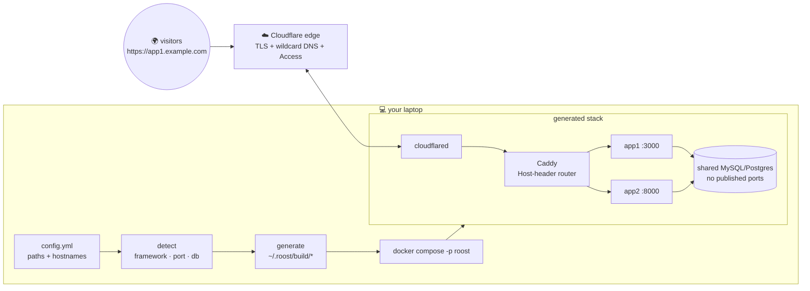

<div align="center">


<br><br>

[](https://github.com/cdrrazan/roost/actions/workflows/ci.yml)
[](go.mod)
[](LICENSE)
[](https://github.com/cdrrazan/roost/releases)

[Website](https://roost.pages.dev) · [Examples](examples/) · [Config reference](docs/configuration.md) · [Roadmap](ROADMAP.md) · [Contributing](CONTRIBUTING.md)

</div>

---

roost turns a list of local application folders into running, HTTPS-accessible
apps on your own domain. You tell it *where each app lives* and *what hostname
it should answer on* — it infers everything else: framework, port, database,
start command, memory cap. Under the hood it generates Docker Compose, a Caddy
reverse proxy, and a Cloudflare Tunnel, and manages all the DNS via API. You
never write a Dockerfile, a Compose file, or a tunnel config, and roost never
adds a single file to any of your repos.

```yaml
# ~/.roost/config.yml — this is the whole thing
domain: demo.example.com
apps:
  - ~/projects/app1              # → https://app1.demo.example.com
  - path: ~/work/some-rails-app
    domain: crm.example.com      # explicit hostname, any zone in your account
```

<div align="center">

</div>

More configs — from two-liners to every knob, plus a [fully-populated demo
with fake data](examples/demo/config.yml) — live in [`examples/`](examples/).

## 🧭 How it works



One tunnel, **one wildcard DNS record per routing suffix**, host-header
routing inside. That architecture is why adding app number seven is a purely
local change — no DNS call, no dashboard visit, no new certificate:

```bash
roost add ~/projects/app7 --domain app7.example.com && roost up
```

## 🌙 The honest part: this is not hosting

Your apps **roost** while the laptop is open and leave when it closes. Lid
shut, machine asleep, on a plane — your apps are down. roost is a local-first
preview and personal-hosting tool for demos, side projects, and sharing work
in progress. It is not a replacement for a server; when the laptop wakes,
cloudflared reconnects within ~5–10 seconds and everything is live again.

## ⚡ 60-second quickstart

Prerequisites (one-time, roost automates everything else — see
[below](#what-roost-manages-vs-what-you-do)): your domain is added to
Cloudflare with nameservers pointed there, and Docker is installed.

```bash
brew install cdrrazan/tap/roost   # or: curl -fsSL https://raw.githubusercontent.com/cdrrazan/roost/main/install.sh | sh

roost init          # picks your domain from your live zone list, scans a folder for apps
roost auth login    # paste an API token (init links the exact page + scopes)
roost doctor        # Docker running? token scopes? SSL depth? DNS shadowing?
roost tunnel setup  # creates the tunnel + every DNS record via API
roost up            # generate, build, start, route
roost enable        # start everything at login
```

### Installing from source

A standard Go build — Go 1.24+, no build scripts, two dependencies fetched
automatically. No Go on your machine? `brew install go` (macOS),
`sudo dnf install golang` (Fedora), or the official tarball from
[go.dev/dl](https://go.dev/dl/) (Debian/Ubuntu's `apt` version is often too
old) — then make sure `~/go/bin` is on your `PATH`:

```bash
git clone https://github.com/cdrrazan/roost && cd roost
go install ./cmd/roost            # installs to ~/go/bin (ensure it's on PATH)

# or build a binary and place it yourself:
go build -o roost ./cmd/roost && sudo install -m 0755 roost /usr/local/bin/roost

# optional: stamp the version instead of "dev"
go build -ldflags "-X main.version=$(git describe --tags --always)" -o roost ./cmd/roost
```

Once the module is published you can skip the clone entirely:
`go install github.com/cdrrazan/roost/cmd/roost@latest`. Runtime
prerequisites are the same as any install: Docker running, and a Cloudflare
API token when you reach `tunnel setup` — `cloudflared` is not needed on the
host, roost runs it as a container. `go test ./...` is a fast, network-free
sanity check before installing.

## 🤝 What roost manages vs what you do

| 🧑 You, once ever | 🤖 roost, every time |
|---|---|
| Point your domain's nameservers at Cloudflare (registrar dashboard) | Creates the tunnel and writes its ingress |
| Create one API token — a genuine bootstrap problem, `roost init` links the page and lists the scopes | Creates **every DNS record** via API |
| | Applies Access policies across every suffix |
| | Runs `cloudflared` as a container |

There is no "now add this CNAME in your dashboard" step — that would
contradict roost holding `Zone:DNS:Edit`.

## 🧰 Commands

| Command | What it does |
|---|---|
| `roost init` | interactive setup; writes `~/.roost/config.yml` with explicit hostnames |
| `roost add <path>` / `remove <name>` | edit the app list (comments preserved) |
| `roost list` / `detect` | resolved apps and URLs; framework detection with the signal that triggered it |
| `roost generate` | write `~/.roost/build/*` without starting anything |
| `roost up [--profile p]` / `down` | start (staggered) / stop the stack |
| `roost status` / `logs <app> [-f]` / `restart <app>` | day-to-day operations |
| `roost doctor` | preflight: every failure comes with a specific fix |
| `roost tunnel setup [--adopt] [--force]` | tunnel + all DNS records via API |
| `roost tunnel access` | Cloudflare Access policy across every suffix |
| `roost auth login` | store the API token (`~/.roost/credentials`, 0600) |
| `roost enable` / `disable` | boot-on-login via launchd / systemd --user |

The full schema, resolution order, and hostname rules are in the
[configuration reference](docs/configuration.md).

## 🔍 What gets inferred from a bare path

| Signal in the folder | Framework | Port | Start |
|---|---|---|---|
| `Gemfile` + `config/application.rb` | rails | 3000 | puma, bound to 0.0.0.0 |
| `Gemfile` + `config.ru` + sinatra | sinatra | 4567 | rackup |
| `package.json` with `next` | next | 3000 | `npm run start` |
| `package.json` with `vite` | static | 80 | built, served by Caddy |
| `package.json` with `express` | node | 3000 | `npm run start` |
| `manage.py` + requirements/pyproject | django | 8000 | gunicorn |
| `index.html`, no manifest | static | 80 | served by Caddy |

Also inferred: runtime version (`.ruby-version`, `engines`, …), database need
(from `database.yml`, `DATABASE_URL`, gems — one shared MySQL/Postgres with a
database per app), and memory caps. Detection is explainable (`roost detect`
shows the signal) and never guesses silently — an unrecognizable folder is an
error telling you to set `framework:` yourself. Every inferred value is
overridable per app in the config.

Baked-in gotcha handling: `RAILS_ASSUME_SSL` (Cloudflare terminates TLS, so
`force_ssl` apps would redirect forever), containers bound to `0.0.0.0` (a
loopback bind gives Caddy a 502 while the app logs look healthy), no published
ports for apps *or* databases, `WEB_CONCURRENCY=1` for single-user Rails,
staggered starts so six apps don't spike your CPU at once, and a doctor check
for the multi-level subdomain SSL trap (free Universal SSL covers **one**
subdomain level — `app.demo.example.com` needs ACM or a flatter name).

## ⚖️ How it compares

| | roost | DockFlare | TunnelDock / cloudflare-companion | Coolify |
|---|---|---|---|---|
| Input | ✅ a list of source folders | 🏷️ running containers + labels | 🏷️ running containers + labels | 🌐 git repos, web UI |
| Dockerfiles/Compose | ✅ **generated for you** | ❌ you write them | ❌ you write them | ⚠️ buildpacks/you |
| DNS strategy | ✅ one wildcard per suffix, zero API calls per app | ⚠️ per-hostname API records | ⚠️ per-hostname API records | ⚠️ your server's DNS |
| Adding an app | ✅ local change only | ❌ edit labels, API calls | ❌ edit labels, API calls | ⚠️ UI/git |
| Runs on | 💻 your laptop | 🖥️ your Docker host | 🖥️ your Docker host | ☁️ a server you operate |

roost's distinction: it starts from **source paths, not containers**. The
label-driven tools automate tunnel routing for containers you already
maintain; roost generates the entire container layer from your code and treats
the tunnel as an implementation detail.

## 🔐 Security defaults

- Set `tunnel.access.emails` in the config and every suffix gets a Cloudflare
  Access wall **before** first exposure — hostnames leak via Certificate
  Transparency logs within hours, so public tunnels get scanned fast. Without
  it, roost prints exactly which hostnames are public.
- Database containers never publish ports; neither do apps. Caddy reaches them
  on the internal network.
- API token in `~/.roost/credentials` (0600 enforced) or
  `$CLOUDFLARE_API_TOKEN` — never in `config.yml`.
- roost refuses to overwrite DNS records it didn't create (`--force` to
  override) and refuses to adopt a tunnel it didn't create (`--adopt`).

The full threat model and reporting process are in [SECURITY.md](SECURITY.md).

## 🗂️ Layout on disk

```
~/.roost/
├── config.yml        # the file you edit (may `include:` more app files)
├── credentials       # CF API token, 0600
├── state.json        # tunnel ID, created DNS records
├── build/            # ALL generated artifacts (compose.yml, Caddyfile, dockerfiles/)
└── logs/
```

Your app repos are never touched. Uninstalling is `roost down && roost
disable` and deleting `~/.roost`.

## 🌱 Project

- **[Examples](examples/)** — runnable configs from minimal to every-knob,
  plus a [demo with fake data](examples/demo/config.yml).
- **[Website](https://roost.pages.dev)** — the one-page overview
  ([source](site/), deployable to Cloudflare Pages).
- **[Roadmap](ROADMAP.md)** — what's next, and the non-goals that keep roost
  small.
- **[Contributing](CONTRIBUTING.md)** — house rules (TDD, no real
  Docker/network in tests, two dependencies) and how to add a framework.
- **[Security policy](SECURITY.md)** · **[Code of Conduct](CODE_OF_CONDUCT.md)**
- **Support the project** — via [GitHub Sponsors](https://github.com/sponsors/cdrrazan)
  (see [FUNDING](.github/FUNDING.yml)).

Built with Go 1.22+, exactly two dependencies (cobra, yaml.v3). `go test
./...` runs the whole suite — no test touches Docker or the network (shell
calls go through a fake; the Cloudflare API is `httptest`). TDD is the house
rule: failing test first.

## 📄 License

[MIT](LICENSE) © [Rajan Bhattarai](https://github.com/cdrrazan)
