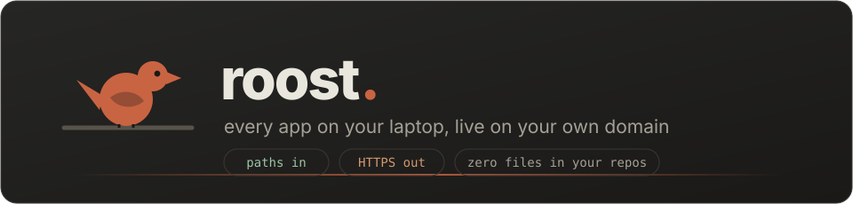
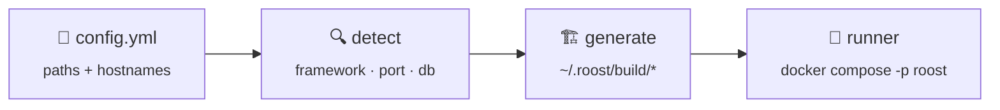
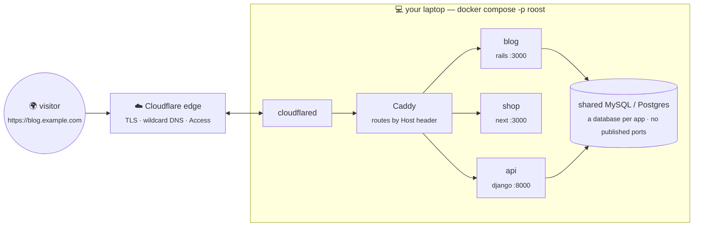
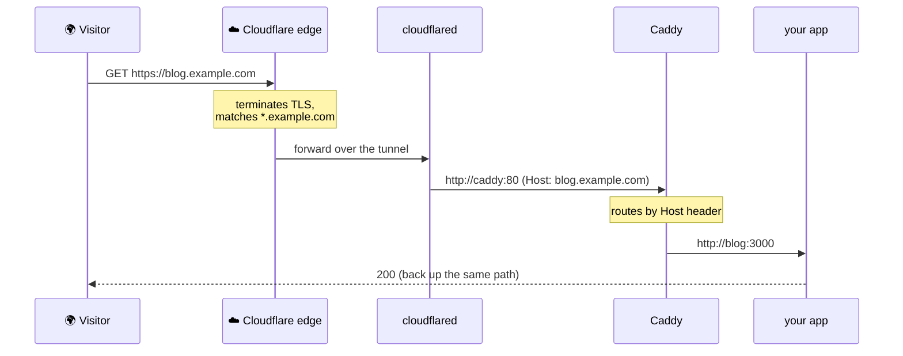
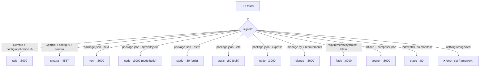
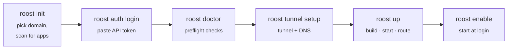

<div align="center">



<br><br>

[](https://github.com/cdrrazan/roost/actions/workflows/ci.yml)
[](go.mod)
[](LICENSE)
[](https://github.com/cdrrazan/roost/releases)
[](go.mod)

**[Website](https://roost.app.rsynk.com) · [Examples](examples/) · [Config reference](docs/configuration.md) · [Roadmap](ROADMAP.md) · [Contributing](CONTRIBUTING.md)**

</div>

---

**roost turns a list of local app folders into running, HTTPS apps on your own domain.**
You tell it *where each app lives* and *what hostname it answers on* — it infers
everything else: framework, port, database, start command, memory cap. Under the
hood it generates Docker Compose, a Caddy reverse proxy, and a Cloudflare Tunnel,
and manages all the DNS via API.

> You never write a Dockerfile, a Compose file, or a tunnel config — and roost
> **never adds a single file to any of your repos**. Every artifact lands under
> `~/.roost/build/`.

```yaml
# ~/.roost/config.yml — this is the whole thing
domain: demo.example.com
apps:
  - ~/projects/blog              # → https://blog.demo.example.com
  - path: ~/work/some-rails-app
    domain: crm.example.com      # explicit hostname, any zone in your account
```

```console
$ roost up
up: blog → https://blog.demo.example.com
up: crm  → https://crm.example.com
```

<div align="center">

</div>

<div align="center">
<sub>From two-liners to every-knob configs — plus a <a href="examples/demo/config.yml">fully-populated demo</a> — in <a href="examples/"><code>examples/</code></a>.</sub>
</div>

---

## 🧭 How it works

One command runs a four-stage pipeline; everything downstream is generated.



The generated stack: **one tunnel, one Caddy, one shared database**, and one
container per app — none of them publishing a host port.



**One wildcard DNS record per routing suffix**, host-header routing inside. That's
why adding app number seven is a *purely local* change — no DNS call, no dashboard
visit, no new certificate:

```bash
roost add ~/projects/app7 --domain app7.example.com && roost up
```

<details>
<summary><b>The request path, end to end</b></summary>


</details>

---

## ✍️ One config, every knob

A bare path is enough; a map opens up per-app overrides. Both forms mix freely.

```yaml
domain: demo.example.com          # fallback suffix for bare-path apps
tunnel:
  name: rserver                   # your tunnel's name (never generated)
  access:
    emails: [me@example.com]      # Cloudflare Access wall before first exposure
defaults:
  memory: 512m                    # per-app default

apps:
  - ~/projects/blog               # 👈 bare path — everything inferred

  - path: ~/work/crm              # 👈 map form — override anything
    domain: crm.example.com       #    verbatim FQDN, any zone in your account
    framework: rails              #    default: detected
    port: 3001                    #    default: framework default
    database: mysql               #    default: detected
    memory: 768m
    profile: extras               #    only starts with --profile extras
    seed: true                    #    migrate + seed on up (once, tracked)
    env:                          #    runtime environment (container)
      SECRET_KEY_BASE: "…"
    build_env:                    #    build-time environment (Docker builder)
      SKIP_ENV_VALIDATION: "1"
```

| Key | Purpose |
|---|---|
| `env:` | **runtime** environment — compose `environment:` |
| `build_env:` | **build-time** environment — `ENV` in the Docker builder stage, for frameworks that validate config during their build (e.g. a Next.js app using `@t3-oss/env` needing `SKIP_ENV_VALIDATION`, or `NPM_CONFIG_LEGACY_PEER_DEPS` for a stubborn install). Bakes into image layers — keep secrets in `env:`. |
| `seed:` | **DB setup on `up`.** Any database-backed app is migrated on every `up` (Rails `db:prepare`, Django `migrate`). `seed: true` also runs the framework's default seed command (Rails `db:seed`) — or `seed: "<command>"` runs yours — **once** per app, recorded in `state.json`; `roost up --reseed` re-runs, `roost up --no-seed` skips all seeding for that run (migrations still run — a clean start with no demo data). Seeds execute with `SEED_DEMO=1` so gated demo seeds fire. A failed seed is never marked done, and if the MySQL data volume is recreated (Clean/Purge, `volume rm`) roost re-seeds every app automatically on the next `up` — unless you pass `--no-seed`. Put schema creation in `migrate:` (not `seed:`) so it still runs under `--no-seed`. |
| `migrate:` | **Opt out of roost's migrate step.** Default runs the framework's `db:prepare`/`migrate` on every `up`. Set `migrate: false` when the image already migrates itself at boot (Kamal-style entrypoints) — otherwise the two `db:prepare`s race and a multi-db app (Solid Queue/Cache/Cable) fails with `No database selected`. `migrate: "<command>"` runs your command instead. |
| `redis:` | **Shared Redis broker.** Auto-detected from the `sidekiq`/`redis` gem or a `REDIS_URL` in `.env.example` — roost provisions one `redis:7-alpine` shared by every app that needs it and injects `REDIS_URL=redis://redis:6379/0`. `redis: true`/`false` overrides the detection. |
| `worker:` + `command:` | **Background workers.** `command:` overrides an app's start command. A second entry over the same `path:` with `worker: true` runs a non-HTTP process (Sidekiq, Solid Queue) — no domain, no Caddy route, no `db:prepare`/seed (the web entry owns the DB). It **requires** a `command:`. Point its `DATABASE_URL` at the web app's DB (an explicit `env:` value wins over roost's per-app default). |
| `category:` | **Display grouping for `roost web` only** — `main` or `utility` (empty = main). Buckets the app under *Main apps* / *Utilities* in the control panel; `worker: true` apps always show under *Workers*. No effect on how roost builds or runs anything. |

### 🧩 Split a big fleet across files — `include`

When one file grows unwieldy, move apps into their own files and pull them in.
Each included file carries **only** an `apps:` list; the domain, tunnel, and
defaults stay central.

```yaml
# ~/.roost/config.yml
domain: example.com
include: apps/*.yml               # a glob, or a list of globs
```

```yaml
# ~/.roost/apps/blog.yml
apps:
  - path: ~/projects/blog
    domain: blog.example.com
```

Paths in an included file resolve against *that file's* directory; a pattern
matching no files is an error, never a silent skip. Full schema, resolution
order, and hostname rules: **[configuration reference](docs/configuration.md)**.

### 🔑 One demo login everywhere — `seed.env`

Drop a `~/.roost/seed.env` (mode `0600`, kept out of `config.yml` like every
other secret) and roost injects its `KEY=VALUE` pairs into **every app
container's** environment. Point each app's seed script at those variables and a
single super-admin logs into all of them:

```bash
# ~/.roost/seed.env
SEED_ADMIN_EMAIL=me@example.com
SEED_ADMIN_PASSWORD=one-strong-shared-secret
```

```ruby
# db/seeds.rb, in each app — env-driven, with a standalone fallback
admin_email    = ENV.fetch("SEED_ADMIN_EMAIL", "demo@example.com")
admin_password = ENV.fetch("SEED_ADMIN_PASSWORD", "password123")
```

Blank lines and `#`-comments are ignored; a missing file injects nothing (the
feature is opt-in). A per-app `env:` value with the same key still wins, so any
app can opt out of the shared credential.

---

## 🔍 What gets inferred from a bare path



| Signal in the folder | Framework | Port | Start |
|---|---|---|---|
| `Gemfile` + `config/application.rb` | rails | 3000 | puma, bound to `0.0.0.0` |
| `Gemfile` + `config.ru` + sinatra | sinatra | 4567 | rackup |
| `package.json` with `next` | next | 3000 | `npm run start` |
| `package.json` with `@sveltejs/kit` | node | 3000 | `node build` (adapter-node) |
| `package.json` with `astro` | static | 80 | built, served by Caddy |
| `package.json` with `vite` | static | 80 | built, served by Caddy |
| `package.json` with `express` | node | 3000 | `npm run start` |
| `manage.py` + requirements/pyproject | django | 8000 | gunicorn |
| requirements/pyproject with `Flask` | flask | 8000 | `gunicorn … app:app` |
| `artisan` + `composer.json` | laravel | 8000 | `php artisan serve` |
| `index.html`, no manifest | static | 80 | served by Caddy |

Also inferred: **runtime version** (`.ruby-version`, `engines`, …), **database
need** (from `database.yml`, `DATABASE_URL`, gems), and **memory caps**.
Detection is *explainable* — `roost detect` names the signal that triggered it —
and never guesses silently: an unrecognizable folder is an error telling you to
set `framework:` yourself. Every inferred value is overridable per app.

<details>
<summary><b>Baked-in gotcha handling</b> — the traps roost defuses for you</summary>

- **`RAILS_ASSUME_SSL`** — Cloudflare terminates TLS, so a `force_ssl` app would
  otherwise redirect forever.
- **`0.0.0.0` binds** — a loopback bind gives Caddy a silent 502 while the app
  logs look healthy. Start commands always bind all interfaces.
- **No published ports** — for apps *or* databases; Caddy reaches them on the
  internal network only.
- **`WEB_CONCURRENCY=1`** — single-user local Rails workloads don't need a worker
  pool.
- **Per-app health checks** — every HTTP app gets a generated compose
  `healthcheck` that TCP-probes its own port with a runtime binary the image
  already has (no curl/wget assumption), so `roost status` shows real
  `healthy`/`starting`/`unhealthy` instead of just "container up".
- **Staggered starts** — six apps don't spike your CPU at once on first build.
- **Multi-database Rails** — a per-app database user so apps that connect as their
  own username and use Solid Cache/Queue/Cable (sibling `<app>_*` databases) just
  work.
- **Compiled vs interpreted** — Rails/Django/Sinatra source is bind-mounted so a
  `restart` picks up edits; next/node/static build into the image (mounting the
  host source would shadow the build).
- **Self-healing proxy** — after (re)starting containers, Caddy is reloaded and
  `cloudflared` refreshed on new routes, so the proxy never serves stale
  upstreams or 404s a just-added zone.
- **DB ready on `up`** — database-backed apps are migrated every `up`, and
  `seed:` apps are seeded once (tracked in `state.json`, `--reseed` to repeat,
  `--no-seed` to skip seeding for a clean start), so a fresh box comes up with a
  working, populated database — no manual `exec … db:prepare` afterwards.
- **The SSL-depth trap** — free Universal SSL covers **one** subdomain level;
  `app.demo.example.com` needs ACM or a flatter name. `roost doctor` flags it.
</details>

---

## 🌙 The honest part: this is not hosting

Your apps **roost** while the laptop is open and leave when it closes. Lid shut,
machine asleep, on a plane — your apps are down. roost is a **local-first preview
and personal-hosting** tool for demos, side projects, and sharing work in
progress. It is not a replacement for a server; when the laptop wakes,
`cloudflared` reconnects within ~5–10 seconds and everything is live again.

---

## ⚡ 60-second quickstart

**Prerequisites** (one-time): your domain is on Cloudflare with nameservers
pointed there, and Docker is installed. roost automates everything else.

```bash
brew install cdrrazan/tap/roost   # or: curl -fsSL https://raw.githubusercontent.com/cdrrazan/roost/main/install.sh | sh
```



```bash
roost init          # picks your domain from your live zone list, scans a folder for apps
roost auth login    # paste an API token (init links the exact page + scopes)
roost doctor        # Docker running? token scopes? SSL depth? DNS shadowing?
roost tunnel setup  # creates the tunnel + every DNS record via API
roost up            # generate, build, start, route
roost enable        # start everything at login
```

<details>
<summary><b>Installing from source</b></summary>

A standard Go build — Go 1.24+, no build scripts, two dependencies fetched
automatically. No Go? `brew install go` (macOS), `sudo dnf install golang`
(Fedora), or the tarball from [go.dev/dl](https://go.dev/dl/) — then put
`~/go/bin` on your `PATH`.

```bash
git clone https://github.com/cdrrazan/roost && cd roost
go install ./cmd/roost            # installs to ~/go/bin

# or build a binary and place it yourself:
go build -o roost ./cmd/roost && sudo install -m 0755 roost /usr/local/bin/roost

# optional: stamp the version instead of "dev"
go build -ldflags "-X main.version=$(git describe --tags --always)" -o roost ./cmd/roost
```

Once published: `go install github.com/cdrrazan/roost/cmd/roost@latest`.
`cloudflared` is **not** needed on the host — roost runs it as a container.
`go test ./...` is a fast, network-free sanity check before installing.
</details>

---

## 🖥️ Web control panel — `roost web`

`roost web` serves a small **dashboard** so you can run the whole fleet from a
browser — start/stop apps, add or remove them, and watch status — without
touching the terminal.

```bash
roost web                        # http://127.0.0.1:4600
roost web --addr 0.0.0.0:4600 --token "$(openssl rand -hex 24)"
```

It runs as a **host process outside** the compose stack, on purpose: stopping
the apps from the panel can't take down the thing that starts them again. What
it does:

- **Live status** — every app grouped into **Main apps / Utilities / Workers**
  (from the per-app [`category:`](#-one-config-every-knob) key), with a state
  pill, health, and a colour-coded **memory bar**; a *Needs attention* strip
  surfaces anything not running, and metric cards summarise running / memory /
  stopped.
- **Control** — **Start all** / **Stop all**, or per-app **Start** / **Stop**.
  Stop leaves Caddy + the tunnel up so the panel stays reachable (only the CLI
  `roost down` tears down everything).
- **Add / remove apps** — an *Add app* modal takes a host path (+ optional
  hostname), runs **`roost doctor`** as a preflight gate, then edits the config,
  regenerates, and builds + starts just that app — streaming each step into a
  **Processing** log. Remove drops it (optionally deleting the image to free
  disk) and lists it under **Removed** for one-click re-add. Shared database
  volumes are never touched.
- **At a glance** — donut gauges for fleet + memory and a per-app memory bar
  chart up top; a right rail with an Overview, a **Server** card (disk, host, OS,
  CPU/RAM, uptime, and the IP + a copyable SSH login from the `server:` block),
  recent activity, and the removed-apps list.
- **Health & incidents** — real HTTP **reachability chips** (`live · 200` vs a
  `502` that a green "container up" would hide), an **incident** banner + timeline
  on down/recovered transitions, and optional **email alerts** (SMTP; the password
  comes from `$ROOST_SMTP_PASSWORD`, never config). Click any app for a **detail
  drawer** — image, restarts, env **key names**, and a recent-log tail.
- **Comfort** — a **Material Design 3** interface (tonal surfaces, ripples,
  elevated cards) in light / **dark**; search, **filter chips** with a friendly
  empty state, **list / grid** views, a **⌘K command palette**, and fully
  mobile-responsive.

**Exposing it.** Set the top-level `control_host:` in `config.yml` and roost
routes that hostname through the tunnel to the panel; then put **Cloudflare
Access** in front of it. The default bind is loopback (`127.0.0.1:4600`); the
`--token` / `$ROOST_WEB_TOKEN` bearer check is defense-in-depth on the mutating
actions. **The Add form builds whatever Dockerfile lives at the path you give
it — never expose the panel without Cloudflare Access.**

```yaml
# ~/.roost/config.yml
control_host: control.example.com   # routed through the tunnel to roost web
```

Run it always-on with a systemd `--user` unit or a launchd agent (the same
mechanism as `roost enable`), and front it with Access. See the
[running-it FAQ](#-faq--running-it-for-real) for the always-on-box playbook.

---

## 🧰 Commands

**Setup**
| Command | What it does |
|---|---|
| `roost init` | interactive setup; writes `~/.roost/config.yml` with explicit hostnames |
| `roost auth login` | store the API token (`~/.roost/credentials`, `0600`) |
| `roost doctor [--fix]` | preflight: every failure comes with a specific fix. `--fix` applies the safe subset — chmod the credentials file, create a missing tunnel DNS record, flip a grey-cloud record to proxied |
| `roost tunnel setup [--adopt] [--force]` | tunnel + all DNS records via API |
| `roost tunnel access` | Cloudflare Access policy across every suffix |

**Everyday**
| Command | What it does |
|---|---|
| `roost up [--profile p] [--reseed] [--no-seed]` / `down [--remove-dns]` | start (staggered), migrate + seed DB apps / stop the whole stack. `--no-seed` migrates but skips all seeding this run (clean start, no demo data); mutually exclusive with `--reseed`. `down --remove-dns` also deletes the DNS records roost created |
| `roost uninstall` | stop the stack and delete the DNS records **and** the tunnel roost created (only what `state.json` records — never foreign records or tunnels). Config and build artifacts stay |
| `roost start <app>` / `stop <app>` / `restart <app>` | act on a single app's container |
| `roost deploy <app>` | `git pull --ff-only` that app's clone, then rebuild + restart just it — the command CI runs over SSH on a push |
| `roost web [--addr] [--token]` | serve a control panel (status, whole-stack and per-app Start/Stop, add/remove apps with a doctor gate) over HTTP; runs as a host process outside the stack, front it with Cloudflare Access |
| `roost status` / `logs [app] [-f]` | state, health, memory, URLs + an advisory **edge** line (tunnel connected / reconnecting-after-wake / down, so a brief 502 isn't mistaken for an app fault) / container logs (all apps if no app named) |
| `roost add <path>` / `remove <name>` | edit the app list (comments preserved) |
| `roost list` / `detect` | resolved apps + URLs / framework detection with its signal |
| `roost generate` | write `~/.roost/build/*` without starting anything |
| `roost enable` / `disable` | boot-on-login via launchd / systemd `--user` |

---

## 🤝 What roost manages vs what you do

| 🧑 You, once ever | 🤖 roost, every time |
|---|---|
| Point your domain's nameservers at Cloudflare | Creates the tunnel and writes its ingress |
| Create one API token — `roost init` links the exact page + scopes | Creates **every DNS record** via API |
| | Applies Access policies across every suffix |
| | Runs `cloudflared` as a container |

There is no "now add this CNAME in your dashboard" step — that would contradict
roost holding `Zone:DNS:Edit`.

---

## ⚖️ How it compares

| | **roost** | DockFlare | TunnelDock / companion | Coolify |
|---|---|---|---|---|
| **Input** | ✅ a list of source folders | 🏷️ containers + labels | 🏷️ containers + labels | 🌐 git repos, web UI |
| **Dockerfiles / Compose** | ✅ **generated for you** | ❌ you write them | ❌ you write them | ⚠️ buildpacks / you |
| **DNS strategy** | ✅ one wildcard per suffix, zero calls per app | ⚠️ per-hostname records | ⚠️ per-hostname records | ⚠️ your server's DNS |
| **Adding an app** | ✅ local change only | ❌ edit labels, API calls | ❌ edit labels, API calls | ⚠️ UI / git |
| **Runs on** | 💻 your laptop | 🖥️ your Docker host | 🖥️ your Docker host | ☁️ a server you operate |

roost's distinction: it starts from **source paths, not containers**. The
label-driven tools automate tunnel routing for containers you already maintain;
roost generates the entire container layer from your code and treats the tunnel
as an implementation detail.

---

## 🔐 Security defaults

- **Access wall before exposure** — set `tunnel.access.emails` and every suffix
  gets a Cloudflare Access login gate *before* first exposure. Hostnames leak via
  Certificate Transparency logs within hours, so public tunnels get scanned fast.
  Without it, roost prints exactly which hostnames are public.
- **Nothing publishes ports** — apps and databases are reachable only on the
  internal Docker network.
- **Token stays out of config** — `~/.roost/credentials` (`0600` enforced) or
  `$CLOUDFLARE_API_TOKEN`, never in `config.yml`.
- **No silent overwrites** — roost refuses to overwrite DNS records it didn't
  create (`--force`) or adopt a tunnel it didn't create (`--adopt`).

Full threat model and reporting: **[SECURITY.md](SECURITY.md)**.

---

## 🗂️ Layout on disk

```
~/.roost/
├── config.yml        # the file you edit (may include: more app files)
├── apps/*.yml        # optional per-feature app files pulled in via include
├── credentials       # CF API token, 0600
├── seed.env          # optional shared demo creds, injected into every app, 0600
├── state.json        # tunnel ID, account, created DNS records
├── build/            # ALL generated artifacts (compose.yml, Caddyfile, dockerfiles/)
└── logs/
```

Your app repos are never touched. Uninstalling is `roost down && roost disable`
and deleting `~/.roost`.

---

## ❓ FAQ — lifecycle & your data

Where does app data live, and what's safe? Every database runs in the shared
MySQL/Postgres container, and its files live in a **named Docker volume**
(`roost-mysql-data`) — decoupled from the containers. Rebuilding images or
recreating containers never touches it; only deleting the volume does.

<details>
<summary><b>If I stop Docker / close the laptop, do my apps go down?</b></summary>

Yes. Docker Desktop off (or laptop asleep) stops the engine, so every container
— apps, Caddy, MySQL, `cloudflared` — stops and all hostnames go unreachable.
**Your data is safe** on disk. When Docker starts again the containers carry
`restart: unless-stopped`, so they come back automatically *if they were running
when it stopped*. For hands-off recovery, enable Docker Desktop's **Start on
login** (Settings → General) — roost has no daemon of its own; Docker's restart
policy is the supervisor.
</details>

<details>
<summary><b>Does <code>roost down</code> then <code>roost up</code> drop my databases?</b></summary>

No. `roost down` stops and removes the *containers*, not the named volume.
`roost up` recreates the containers and reattaches the same `roost-mysql-data`
volume — every database, user, and row is intact. No migrate, no re-seed needed.
The same is true of an image rebuild after you change app code.
</details>

<details>
<summary><b>Which Docker cleanups are safe, and which wipe my data?</b></summary>

| Action | Databases |
|---|---|
| `roost down` / `roost up` / image rebuild | ✅ kept |
| `docker system prune -f` (containers + dangling images) | ✅ kept — named volumes are left alone |
| `docker compose down -v` | ❌ dropped |
| `docker volume rm roost-mysql-data` | ❌ dropped |
| `docker system prune --volumes` / `--all --volumes` | ❌ dropped |
| Docker Desktop → Troubleshoot → **Clean / Purge data** | ❌ **everything** gone |

To reclaim space without losing data, use `docker system prune -f` — it keeps
named volumes.
</details>

<details>
<summary><b>What if I hit Docker Desktop's "Clean / Purge data"?</b></summary>

That's the nuclear option: it wipes the entire Docker VM — **all containers,
images, and named volumes**, including `roost-mysql-data`. Every database and
all demo data is gone, and every image is deleted. The next `roost up` rebuilds
all images from scratch and `mysql-init.sql` recreates empty databases and
users. **roost notices the data volume was recreated** (it tracks the volume's
identity in `state.json`) and **automatically re-migrates and re-seeds every
`seed:` app** on that next `up` — you don't need `--reseed`. Pass `--no-seed` on
that `up` to rebuild empty (migrations run, no demo data). Back the volume up
first if you want the old data back instead:

```bash
docker run --rm -v roost-mysql-data:/data -v "$PWD":/backup alpine \
  tar czf /backup/roost-mysql-data.tar.gz -C /data .
```
</details>

<details>
<summary><b>How do I back up the databases regularly?</b></summary>

roost stores data in Docker named volumes (`roost-mysql-data`,
`roost-postgres-data`); it does **not** back them up for you. For anything you
care about, dump the databases to files on the host — those survive a volume
wipe. The stack must be running (`roost up`):

```bash
# MySQL apps — all databases in one file
docker exec roost-mysql-1 mysqldump -uroot -proost --all-databases \
  --single-transaction --routines --triggers | gzip > mysql-$(date +%F).sql.gz

# Postgres apps — all databases in one file
docker exec roost-postgres-1 pg_dumpall -U roost | gzip > postgres-$(date +%F).sql.gz
```

`--single-transaction` makes the MySQL dump consistent with no downtime.
Restore by piping a dump back into `mysql`/`psql` in the same container. To run
it on a schedule, wrap those two lines in a script and drive it with `cron`, a
launchd agent (macOS), or a systemd timer (Linux) — and mirror the output to
off-machine storage (another disk, S3, a synced cloud folder) so a dead disk
doesn't take the backups with it. **[`scripts/roost-backup.sh`](scripts/)** does
exactly this on a box, and also `age`-encrypts your `~/.roost` secrets (config,
credentials, tunnel token) into the same offsite mirror — so a dead disk takes
neither your data nor your keys.

</details>

---

## ❓ FAQ — running it for real

<details>
<summary><b>Can I control the whole stack from a browser?</b></summary>

Yes — `roost web` serves a small control panel: a live status table with
whole-stack **Start apps** / **Stop apps** buttons *and* per-row **Start** /
**Stop** for each individual app. It runs as a **host process outside** the
compose stack, so stopping the apps can't take down the thing that starts them
back up. Per-app actions are name-checked against your config, so the panel can
never toggle an infra container (Caddy, cloudflared). It binds
`127.0.0.1:4600` by default; expose it only behind
**Cloudflare Access** (set `control_host:` in `config.yml` to route a hostname to
it), and set `--token` / `$ROOST_WEB_TOKEN` as defense-in-depth on the on/off
actions. Anyone who reaches an unprotected panel can stop and start your stack.
</details>

<details>
<summary><b>Can I add or remove apps from the panel?</b></summary>

Yes. The panel has an **Add an app** form (host path + optional hostname) and a
per-row **Remove** button with a *free disk* checkbox. **Add** runs `roost
doctor` first and proceeds only if preflight passes, then edits the config,
regenerates artifacts, and builds + starts just the new app — the **Processing**
pane streams each step live. **Remove** stops and removes that app's container
(and its image if you tick *free disk*), drops it from the config, and lists it
under **Removed apps** for one-click re-add; the shared database volumes are
never touched, so the app's data survives a remove. Because the Add form accepts
**any host path**, the panel builds and runs whatever Dockerfile lives there —
that's a host admin tool, so keep it behind **Cloudflare Access** and the on/off
token. An unauthenticated Add is code execution on the box.
</details>

<details>
<summary><b>If I click "Stop apps" in the panel, does the panel go down too?</b></summary>

No. **Stop** stops only the app containers; Caddy and `cloudflared` — the proxy
and the tunnel — keep running, so the panel stays reachable and can bring the
apps back. **Start** *resumes* the existing stopped containers (`docker compose
start`) rather than rebuilding them, so a full stack comes back in seconds, not
minutes. (`roost down`, by contrast, removes the whole stack including the
tunnel — that's the terminal-only full stop.)
</details>

<details>
<summary><b>Can I run roost on an always-on server instead of my laptop?</b></summary>

Yes — nothing ties it to a laptop. roost is a Go binary driving Docker, so it
runs anywhere Docker does: a small always-on VPS or cloud VM is the natural home
if you want the apps up 24/7 (a laptop only serves while it's awake — see *the
honest part*). To move: install roost + Docker on the box, copy
`~/.roost/config.yml` and `~/.roost/credentials`, restore your database dumps
into the fresh volumes, then `roost up`. The tunnel is **outbound**, so there are
no ports or inbound firewall rules to open, and **no DNS change** on a new box —
Cloudflare finds it by the tunnel token, not its IP. Run `cloudflared` from **one
machine at a time** — two connectors sharing the same tunnel token split traffic
between them.

Moving to a *new* box is scripted: **[`scripts/roost-box-bootstrap.sh`](scripts/)**
fetches and decrypts the latest backup, restores `~/.roost` + the systemd units,
installs the binary, clones the app repos, then brings the stack up and restores
the data — the only IP-bound thing is your SSH access.
</details>

<details>
<summary><b>How do I ship a code change to a running app?</b></summary>

Push to the app's repo, then on the host run `roost deploy <app>`. It does a
`git pull --ff-only` on that app's clone and rebuilds + restarts **only that
container**, leaving the rest of the stack up. Fast-forward-only is deliberate:
if the box's clone has diverged, the deploy fails loudly instead of silently
merging. roost still never writes into your repo — the clone is yours, it only
reads and pulls.
</details>

<details>
<summary><b>Can I auto-deploy on a push to GitHub?</b></summary>

Yes — `roost deploy` is built to be driven by CI over SSH. Add a GitHub Actions
workflow that triggers on `push: branches: [main]`, SSHes into the box with a
deploy key, and runs `roost deploy <app>`. Keep a dedicated key: its public half
in the box's `~/.ssh/authorized_keys`, its private half as a repo secret. Because
the pull is fast-forward-only, a force-push or diverged branch surfaces as a
failed deploy rather than a silent bad merge.
</details>

<details>
<summary><b>How do I keep it running after a reboot, with no one logged in?</b></summary>

`roost enable` installs a boot unit — launchd on macOS, a systemd `--user` unit
on Linux — that runs `roost up` at login. On a headless Linux box, also run
`loginctl enable-linger <user>` so the user's units start at boot without an
interactive login. Docker itself must start on boot too (it does by default on a
server install); roost has no daemon — Docker's `restart: unless-stopped` policy
is the supervisor.
</details>

---

## 🌱 Project

- **[Examples](examples/)** — runnable configs from minimal to every-knob, plus a
  [demo with fake data](examples/demo/config.yml) and an
  [`include` walkthrough](examples/includes/).
- **[Website](https://roost.app.rsynk.com)** — one-page overview ([source](site/)).
- **[Ops scripts](scripts/)** — running a fleet on an always-on box: an encrypted
  backup (DB dumps + `age`-encrypted secrets → R2) and a one-shot bootstrap that
  rebuilds a fresh VM. The tunnel is IP-independent, so a new box needs no DNS change.
- **[Roadmap](ROADMAP.md)** — what's next, and the non-goals that keep roost small.
- **[Contributing](CONTRIBUTING.md)** — house rules (TDD, no real Docker/network in
  tests, two dependencies) and how to add a framework.
- **[Security policy](SECURITY.md)** · **[Code of Conduct](CODE_OF_CONDUCT.md)**
- **Support** — via [GitHub Sponsors](https://github.com/sponsors/cdrrazan).

Built with **Go 1.24+**, exactly **two dependencies** (`cobra`, `yaml.v3`).
`go test ./...` runs the whole suite — no test touches Docker or the network
(shell calls go through a fake; the Cloudflare API is `httptest`). TDD is the
house rule: failing test first.

## 📄 License

[MIT](LICENSE) © [Rajan Bhattarai](https://github.com/cdrrazan)
