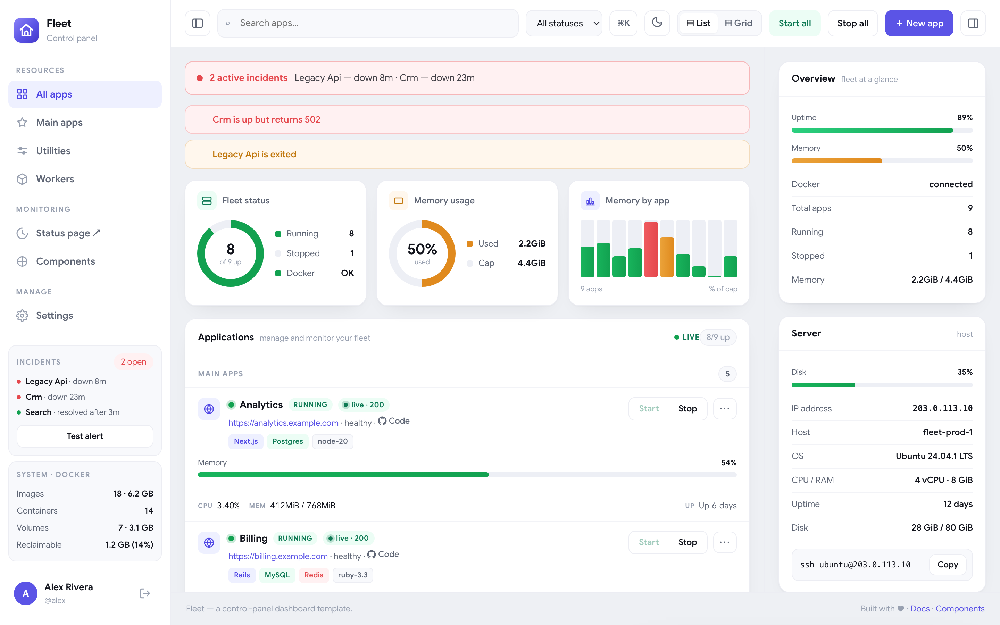
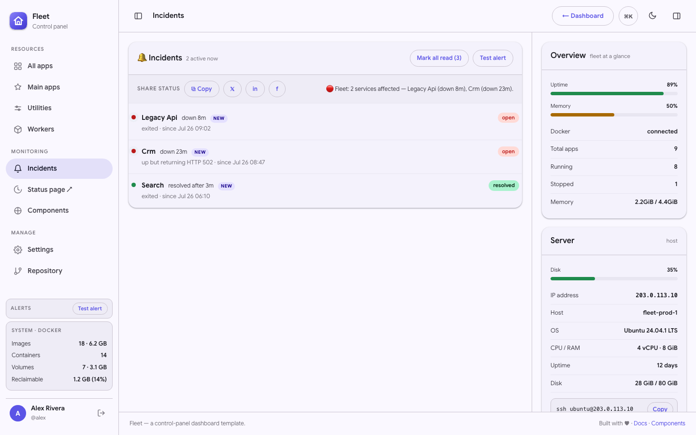
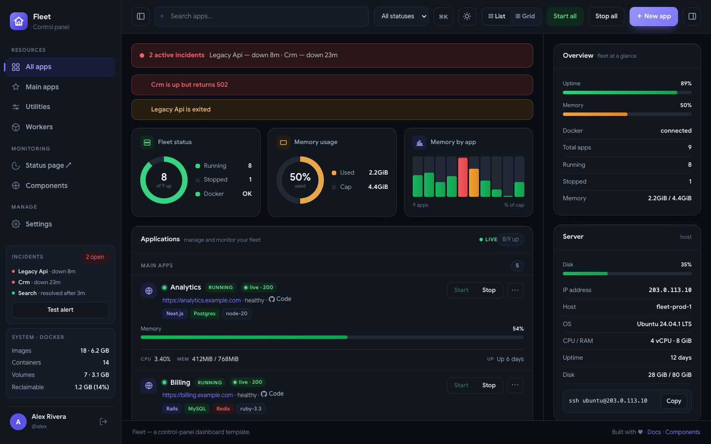
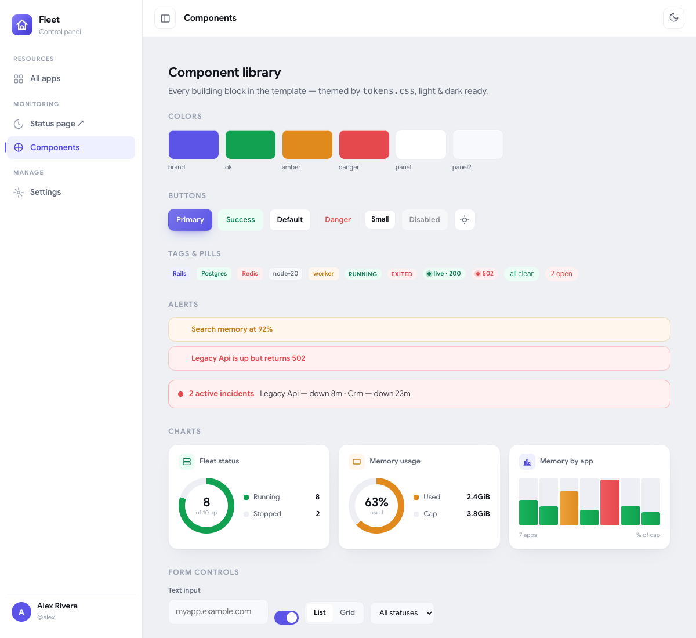
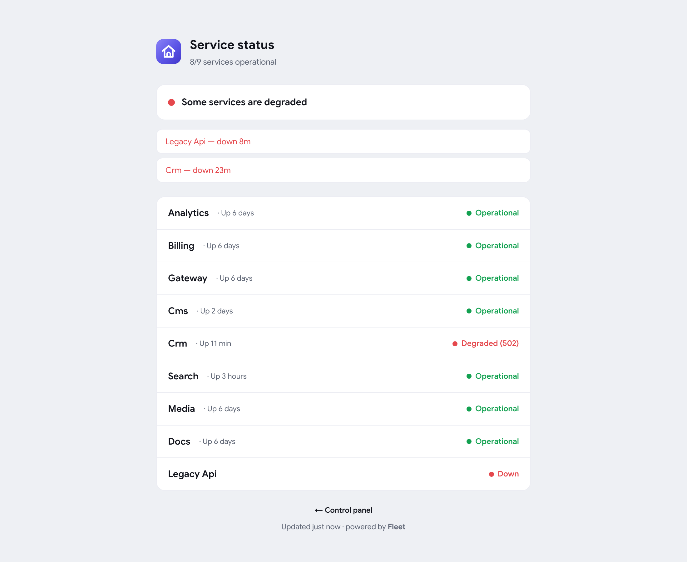
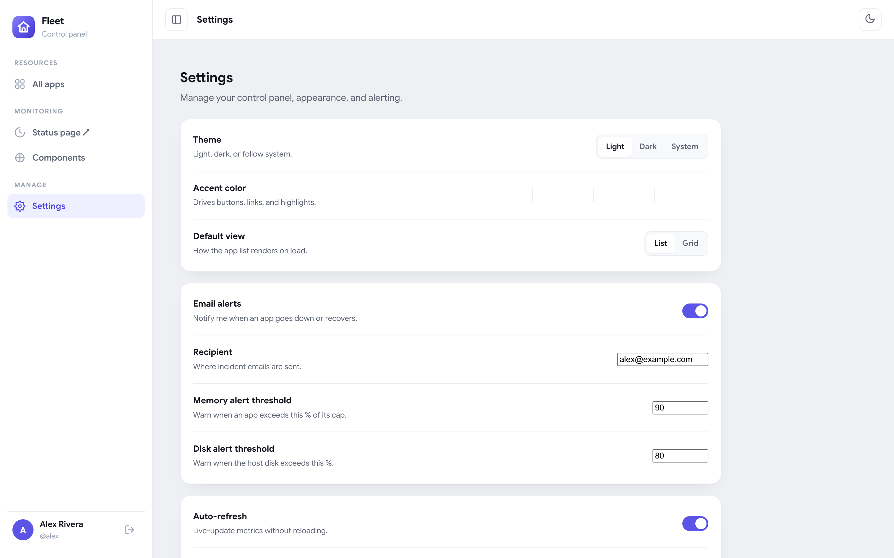

<div align="center">

# ⛵ Fleet — Control Dashboard Template

**A premium, zero-build admin dashboard for self-hosted app fleets.**
Live metrics · real reachability · incidents & share · settings · command palette · light & dark — in pure HTML/CSS/JS.

`no framework` · `no build step` · `~30 KB CSS` · `light + dark` · `fully responsive`

### [▶ Live demo](https://cdrrazan.github.io/Roost/) · [Incidents](https://cdrrazan.github.io/Roost/incidents.html) · [Settings](https://cdrrazan.github.io/Roost/settings.html) · [Status page](https://cdrrazan.github.io/Roost/status.html)

</div>

---

## 📸 Preview





<div align="center">

| Dark | Components |
|---|---|
|  |  |
| **Public status** | **Settings** |
|  |  |

</div>

---

## Why Fleet

Most admin templates are a pile of charts with no story. Fleet is modeled on a **real** operations panel: it shows a fleet of apps, whether each is *actually serving traffic*, live CPU/memory/network, incidents with a timeline, and one-keystroke control. Drop it in, point it at your data, ship.

It's **vanilla** on purpose — open `index.html` and it runs. No `npm install`, no bundler, no framework lock-in. Theme it by editing **one file**.

## ✨ Features

- **Live dashboard** — per-app cards with status, tech badges, CPU %, memory, network, uptime, and a memory sparkline. Metrics update live.
- **Featured apps** — a pinned strip of up to **two** highlighted apps just below the stat gauges (flag with `featured: true`; falls back to your first two apps), each with status, reachability, live metrics, and quick start/stop.
- **Real reachability chips** — "live · 200" vs "502" so you see what's *actually* serving, not just "container up".
- **Incidents** — active-incident banner plus a **dedicated incidents page** (its own nav item) with the full open/resolved history, durations, a **Mark all read** control (history is kept — read entries just dim), and **share** buttons (copy / X / LinkedIn / Facebook) that post a one-line status summary. The sidebar keeps a compact **Test alert** box.
- **Settings** — a working settings page (localStorage): default **view & theme**, a **mask mode** that hides IP / SSH / host / tunnel ids on the cards (safe screen-sharing), **email subject/body templates**, and **tech-stack label overrides**.
- **Command palette** — ⌘K / Ctrl-K fuzzy search over apps and actions with full keyboard nav.
- **Detail drawer** — click any app for image, status, restarts, env keys, that app's own **incident history**, and recent logs.
- **Collapsible panels** — pin the brand + bottom cluster; the nav scrolls; the info rail folds away to stretch the workspace.
- **Public status page** — a controls-free, secret-free `status.html` you can share.
- **7 pages** — dashboard, incidents, status, login, settings, component library, 404.
- **Light & dark** — the viewer's choice, remembered. Both are hand-tuned.
- **One-file theming** — change your brand color in `assets/css/tokens.css`; everything follows.

## 📦 What's inside

```
fleet-dashboard/
├─ index.html          # the dashboard
├─ incidents.html      # incident history + share
├─ status.html         # public status page
├─ login.html          # sign-in screen
├─ settings.html       # preferences (view, theme, mask, email templates, tech stacks)
├─ components.html     # component library / style guide
├─ 404.html            # not-found page
├─ assets/
│  ├─ css/
│  │  ├─ tokens.css    # ← design tokens: EDIT THIS TO REBRAND
│  │  └─ fleet.css     # layout, shell, components
│  ├─ js/
│  │  ├─ theme.js      # theme + layout init (no-flash)
│  │  ├─ mock.js       # ← demo data (swap for your API)
│  │  ├─ fleet.js      # dashboard engine + interactions
│  │  └─ chrome.js     # shared chrome for non-dashboard pages
│  └─ img/favicon.svg
├─ docs/
│  ├─ INTEGRATION.md   # wire it to a real backend
│  └─ CUSTOMIZE.md     # theming, rebranding, adding pages
├─ README.md · CHANGELOG.md · PRO.md · LICENSE
```

## 🚀 Quick start

No build. Just open it — or serve the folder:

```bash
# option A: open index.html directly in a browser
# option B: any static server
python3 -m http.server 8080     # → http://localhost:8080
npx serve .                      # or this
```

The demo runs entirely from `assets/js/mock.js`. To go live, replace that data (or fetch JSON on load) — see **[docs/INTEGRATION.md](docs/INTEGRATION.md)**.

## 🎨 Make it yours

Open **`assets/css/tokens.css`** and change one line:

```css
--brand: #5b54e6;   /* your accent — buttons, links, active nav, focus */
```

Everything re-themes automatically, in light and dark. Swap the logo in `assets/img/favicon.svg` and the brand text in the sidebar. Full guide: **[docs/CUSTOMIZE.md](docs/CUSTOMIZE.md)**.

## 🧭 Browser support

Modern evergreen browsers (Chrome, Edge, Firefox, Safari). Uses native `<dialog>`, CSS grid, `color-mix()`, and `conic-gradient` — no polyfills.

## 📄 License

The template is **open source under the [MIT License](LICENSE)** — use it in personal and commercial projects freely.

Need the Figma source, extra themes, React/Vue ports, or priority support? See **[PRO.md](PRO.md)**.

## 🙌 Credits

Built by [Rajan Bhattarai](https://github.com/cdrrazan). If Fleet saves you time, a ⭐ is appreciated.
